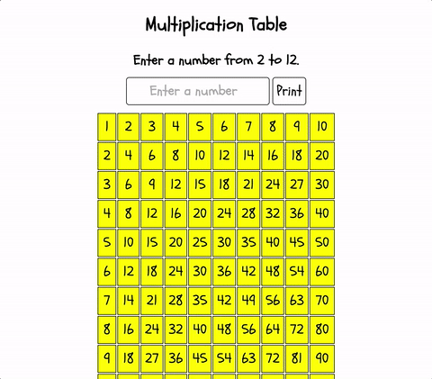

<h1>Multiplication Table</h1>

<strong><a href="https://dreamthink.github.io/multiplicationtable" target="_blank">View demo</a></strong>

A simple multiplication table app built using AngularJS. Students can enter a number between 2 and 12 for a customized multiplication table. Click the print button to print it out!

<h3>BUILT WITH:</h3>
HTML, CSS, JavaScript, AngularJS

<strong><a href="https://dreamthink.github.io/multiplicationtable" target="_blank">View demo</a></strong>